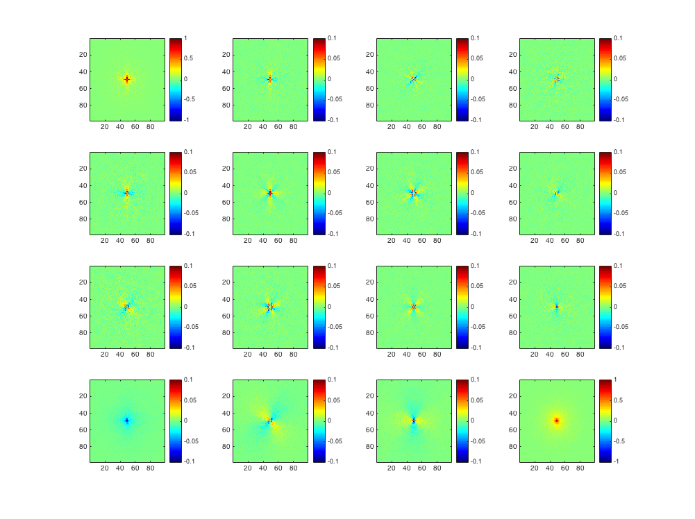

Modular Monte Carlo for Polarized Light (MMCPL)
=============================================
Polarized Monte Carlo in C++

Project Start Date: July 25, 2015

Goal
----
Match and extend the capabilities of existing monte carlo simulations
regarding the behavior of polarized light in the presence of spherical
or cylindrical scatterers.

Documentation
-------------
MMCPL is a Monte Carlo simulation that models how polarized light propogates through a 
simulated, homogenous medium containing some predefined collection of scatterers. It is 
designed to be generic so that it ideally requires no code modification to work for your 
experiment. 

Simulation parameters and inputs are passed via a JSON configuration file. To see the required
structure of this configuration file, check out `example_input.json`. 

Right now, MMCPL is limited to spherical scattering models (i.e., Mie scattering theory). 
Next up on the development schedule is the addition of cylindrical scatterers as a configurable
option as well as a balance of different scatterer types. Eventually, the goal is to allow
user-defined scatterers for a much broader range of possible applications.

Future Work (in priority order)
-------------------------------
1. Cylindrical scatterer module
2. User-defined scattering models
3. Simple GUI

Questions?
----------
Email me at reecestevens@utexas.edu if you have questions about the project. If you want to 
contribute, submit a pull request and I will gladly look over it! Also, please make active use
of the issues tracker in GitHub if you experience problems with the code so that your problem
can be resolved as quickly as possible.
